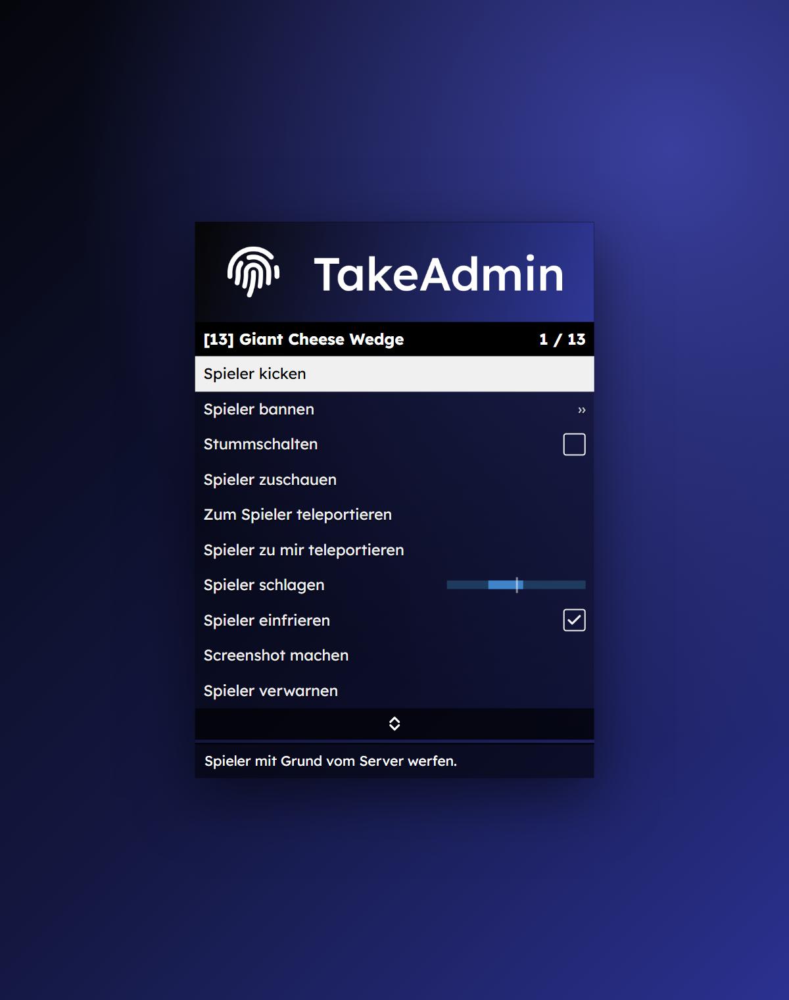
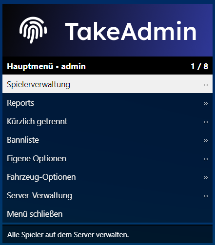

<p align="center">
  
</p>

# TakeAdmin

**Das Admin-Menü für FiveM, mit vollem ESX-Legacy-Support.**

Schnell bedienbar mit Pfeiltasten, Enter und Backspace, im klassischen GTA-Menü-Look. Alles drin, was ein Serverteam braucht: Bannsystem mit Datenbank, Verwarnungen, Reports, Offline-Banns, ESX-Verwaltung, Noclip, Spectate, Fahrzeug- und Server-Tools.

<p align="center">
  
  
</p>

---

## Inhalt

- [Funktionen](#funktionen)
- [Voraussetzungen](#voraussetzungen)
- [Installation](#installation)
- [Rechte einrichten](#rechte-einrichten)
- [Bedienung](#bedienung)
- [Befehle](#befehle)
- [Konfiguration](#konfiguration)
- [Banner und Design](#banner-und-design)
- [Speicherung von Banns und Verwarnungen](#speicherung-von-banns-und-verwarnungen)
- [Discord-Logs](#discord-logs)
- [Sicherheit](#sicherheit)
- [Probleme und Lösungen](#probleme-und-lösungen)
- [Dateistruktur](#dateistruktur)

---

## Funktionen

### Spielerverwaltung
| Funktion | Beschreibung |
|---|---|
| Kicken | Mit Grund, wird allen Teammitgliedern angezeigt |
| Bannen | Grund und Dauer (1 Stunde bis permanent), Bann über Identifier **und** Hardware-Tokens |
| Stummschalten | Sperrt Voice-Chat und Text-Chat |
| Zuschauen (Spectate) | Unsichtbar, funktioniert auch über Instanzen (Routing-Buckets) hinweg |
| Teleport | Zum Spieler oder Spieler zu dir |
| Schlagen | Stärke 1–10 per Regler |
| Einfrieren | Spieler (und Fahrzeug) kann sich nicht bewegen |
| Screenshot | Wird direkt im Menü angezeigt (benötigt `screenshot-basic`) |
| Verwarnen | Mit Zähler; bei zu vielen Verwarnungen wird der Spieler automatisch gekickt oder gebannt |
| Heilen, Wiederbeleben, Töten | Heilen füllt auch Hunger und Durst auf (esx_basicneeds) |
| Privatnachricht | Große Nachricht auf dem Bildschirm des Spielers |
| Spieler-Infos | Ping, Leben, Gruppe, Job, Geld, Instanz, alle Identifier (Enter kopiert den Wert) |

### ESX
- Geld geben oder abziehen (Bargeld, Bank, Schwarzgeld)
- Job setzen: aus einer Liste aller Jobs mit Rängen oder manuell eintippen
- Gruppe setzen (nie höher als die eigene)
- Items geben
- Inventar leeren (auch mit `ox_inventory`)

### Banns und Reports
- **Bannliste** mit Suche, Details und Entbannen
- **Offline-Bann** für Spieler, die den Server gerade verlassen haben
- **Ban-Umgehungsschutz:** Verbindet sich ein gebannter Spieler mit neuen Accounts, werden die neuen Identifier automatisch zum Bann hinzugefügt
- **Reports:** Spieler nutzen `/report`, das Team kann Reports übernehmen, hinteleportieren und schließen
- **Admin-Chat** nur für das Team

### Eigene Optionen
Noclip (mit 5 Geschwindigkeitsstufen), Godmode, Unsichtbar, unendlich Ausdauer, Super-Sprung, schnell rennen, Heilen, Wiederbeleben, Rüstung, Teleport zum Wegpunkt oder zu Koordinaten, Koordinaten anzeigen und kopieren (`vector3`, `vector4`, `x, y, z`, JSON), Spielernamen über dem Kopf, alle Spieler auf der Karte.

### Fahrzeuge
Spawnen (Modellname oder Schnellauswahl), Reparieren, Waschen, Umdrehen, Max-Tuning, Kennzeichen ändern, unzerstörbar machen, Löschen.

### Server
Ankündigung an alle, Wetter, Uhrzeit, Aufräumen (leere Fahrzeuge, NPCs, Objekte), alle wiederbeleben, alle herholen, alle kicken (außer Team), Ressource neu starten.

---

## Voraussetzungen

| Ressource | Nötig? | Wofür |
|---|---|---|
| **OneSync** | Ja | Spectate, Teleport, Spieler-Blips, Aufräumen |
| `es_extended` (ESX Legacy) | Für ESX-Funktionen | Gruppen, Geld, Jobs, Items |
| `oxmysql` | Empfohlen | Dauerhafte Speicherung der Banns in der Datenbank |
| `screenshot-basic` | Optional | Screenshots von Spielern |
| `esx_ambulancejob` | Optional | Wiederbeleben (sonst wird eine eingebaute Variante genutzt) |
| `esx_basicneeds` | Optional | Hunger und Durst beim Heilen auffüllen |

Ohne ESX läuft TakeAdmin im **Standalone-Modus** (Rechte nur über ACE, ESX-Menü ausgeblendet).

---

## Installation

1. Den Ordner `TakeAdmin` in deinen `resources`-Ordner kopieren.
2. In der `server.cfg` **nach** den abhängigen Ressourcen eintragen:

   ```cfg
   ensure oxmysql
   ensure es_extended
   ensure screenshot-basic   # optional

   ensure TakeAdmin
   ```

3. Server starten. In der Konsole sollte stehen:

   ```
   [TakeAdmin] Speicher: MySQL (oxmysql) | 0 Bann(s) geladen.
   ```

4. Dir selbst Rechte geben (siehe unten) und im Spiel **F2** drücken.

> Steht in der Konsole `JSON` statt `MySQL`, startet `oxmysql` nicht vor TakeAdmin. Dann gehen Banns beim Neu-Kopieren des Ordners verloren.

---

## Rechte einrichten

Jede Gruppe hat ein **Level**. Jede Funktion braucht ein **Mindest-Level**. Beides stellst du in der `config.lua` ein.

```lua
Config.Groups = {
    ['superadmin'] = 100,
    ['admin']      = 80,
    ['mod']        = 50,
    ['support']    = 20,
}
```

### Variante A: ESX-Gruppe (empfohlen)
TakeAdmin liest die Gruppe aus `xPlayer.getGroup()` (Spalte `group` in der Tabelle `users`). Gruppe per SQL setzen:

```sql
UPDATE users SET `group` = 'admin' WHERE identifier = 'char1:abc123...';
```

Danach kannst du weitere Gruppen bequem im Menü unter **ESX-Optionen → Gruppe setzen** vergeben.

> ESX Legacy kennt standardmäßig nur `user` und `admin`. Eigene Gruppen wie `mod` oder `support` funktionieren trotzdem, solange sie in `Config.Groups` stehen.

### Variante B: ACE (auch für Standalone)
In der `server.cfg`:

```cfg
add_ace group.admin takeadmin.admin allow
add_principal identifier.license:DEINE_LICENSE group.admin
```

Der Teil nach `takeadmin.` muss einem Gruppennamen aus `Config.Groups` entsprechen. Haben ESX und ACE beide ein Level, zählt das höhere.

### Standard-Rechte

| Level | Gruppe | Darf zusätzlich |
|---|---|---|
| 20 | support | Menü, Kicken, Verwarnen, Stummschalten, Spectate, Teleport, Einfrieren, Screenshot, Heilen, Wiederbeleben, Reports, Noclip, Admin-Chat |
| 50 | mod | Bannen, Offline-Bann, Bannliste, Schlagen, Godmode, Unsichtbar, Spieler-Blips, Fahrzeuge, Ankündigungen |
| 80 | admin | Entbannen, Töten, Job setzen, Items geben, Inventar leeren, Wetter, Uhrzeit, Aufräumen, alle wiederbeleben |
| 100 | superadmin | Geld geben, Gruppe setzen, alle herholen, alle kicken, Ressourcen neu starten |

Jede einzelne Funktion lässt sich in `Config.Permissions` anpassen.

---

## Bedienung

| Taste | Aktion |
|---|---|
| **F2** | Menü öffnen / schließen |
| **↑ ↓** | Navigieren (gedrückt halten zum schnellen Scrollen) |
| **← →** | Wert ändern (Listen, Regler) |
| **Enter** | Auswählen / Schalter umlegen |
| **Backspace / ESC** | Zurück |
| **F3** | Noclip an/aus |

**Noclip:** `W A S D` bewegen, `Q`/`E` runter/hoch, `Shift` schneller, `Alt` langsamer, Mausrad wechselt die Geschwindigkeitsstufe.

Jeder Spieler kann F2 und F3 im Spiel selbst umbelegen: **Einstellungen → Tastenbelegung → FiveM**.

---

## Befehle

### Im Spiel
| Befehl | Wer | Beschreibung |
|---|---|---|
| `/takeadmin` | Team | Menü öffnen (wie F2) |
| `/report <Nachricht>` | Alle | Report an das Team senden (60 Sekunden Abklingzeit) |
| `/a <Nachricht>` | Team | Nachricht im Admin-Chat |

### Server-Konsole / txAdmin-Live-Konsole
| Befehl | Beschreibung |
|---|---|
| `ta_bans` | Alle aktiven Banns mit ID auflisten |
| `ta_bans <Suche>` | Banns nach Name oder Grund filtern |
| `ta_unban <Ban-ID>` | Bann aufheben, z. B. `ta_unban 5` |
| `ta_unban <Name>` | Bann über den genauen Spielernamen aufheben |
| `ta_unban <Identifier>` | Bann über einen Identifier aufheben, z. B. `ta_unban license:abc...` |

Die Ban-ID sieht der gebannte Spieler auch in seiner Bann-Meldung. Das hilft bei Entbannungsanträgen.

> Banns, die du über **txAdmin** vergibst, sind ein eigenes System. Sie hebst du im txAdmin-Webpanel auf, nicht mit `ta_unban`.

---

## Konfiguration

Alles Wichtige steht in der **`config.lua`**:

| Einstellung | Standard | Beschreibung |
|---|---|---|
| `Config.Framework` | `'esx'` | `'esx'` oder `'standalone'` |
| `Config.OpenKey` / `Config.NoclipKey` | `'F2'` / `'F3'` | Standardtasten |
| `Config.MenuPosition` | `'left'` | `'left'` oder `'right'` |
| `Config.AccentColor` | `'#3b82f6'` | Akzentfarbe des Menüs (Hex) |
| `Config.Storage` | `'auto'` | `'auto'`, `'mysql'` oder `'json'` |
| `Config.BanDurations` | 1 h bis permanent | Auswählbare Bann-Dauern |
| `Config.BanAppeal` | Text | Hinweis in der Bann-Meldung, z. B. dein Discord-Link |
| `Config.BanIP` | `false` | IP-Adressen mit bannen (kann Unschuldige im selben Netz treffen) |
| `Config.MaxWarns` | `3` | Ab so vielen Verwarnungen folgt die Strafe |
| `Config.WarnAction` | `'ban'` | `'ban'` oder `'kick'` |
| `Config.WarnBanTime` | `86400` | Bann-Dauer nach zu vielen Verwarnungen (Sekunden, `0` = permanent) |
| `Config.ReviveEvent` | `'esx_ambulancejob:revive'` | Leer lassen für eingebaute Wiederbelebung |
| `Config.HealEvent` | `'esx_basicneeds:healPlayer'` | Leer lassen, wenn nicht vorhanden |
| `Config.Accounts` | money, bank, black_money | Konten im Menü „Geld geben“ |
| `Config.QuickVehicles` | Liste | Fahrzeuge in der Schnellauswahl |
| `Config.Weather` | Liste | Wählbare Wettertypen |
| `Config.ReportCommand` / `Config.AdminChatCommand` | `'report'` / `'a'` | Befehlsnamen |

Serverseitige Geheimnisse wie den Webhook trägst du in **`server/sv_config.lua`** ein. Diese Datei wird nie an Spieler gesendet.

---

## Banner und Design

Das Bild oben im Menü ist **`html/banner.png`**. Es ist **geschützt und kann nicht geändert werden**.

- Beim Start prüft der Server `html/banner.png`, `html/index.html` und `html/style.css` per Prüfsumme.
- Wurde eine dieser Dateien verändert oder gelöscht, ist das Menü für alle **gesperrt**. Die Konsole zeigt dann `[TakeAdmin] Das Menü-Design wurde verändert`.
- Lösung: die Originaldateien wiederherstellen und die Ressource neu starten.

Das Menü nutzt den klassischen GTA-Menü-Look. Schriftart ist **Lexend Deca** (Regular, Bold, Black). Sie liegt lokal in `html/fonts/` und braucht kein Internet. `Config.AccentColor` färbt die Benachrichtigungen. Die Akzentfarbe und die Menü-Position (`Config.MenuPosition`) darfst du weiterhin frei einstellen.

---

## Speicherung von Banns und Verwarnungen

| Modus | Speicherort | Übersteht Neustart | Übersteht Neu-Kopieren des Ordners |
|---|---|---|---|
| **MySQL** (Standard mit oxmysql) | Tabellen `takeadmin_bans`, `takeadmin_warns` | Ja | Ja |
| **JSON** (Fallback) | `data/bans.json`, `data/warns.json` | Ja | **Nein** |

- Die Tabellen werden beim ersten Start automatisch angelegt. Du musst keine SQL-Datei importieren.
- Wechselst du von JSON auf MySQL, werden vorhandene JSON-Einträge beim nächsten Start automatisch in die Datenbank übernommen.
- Abgelaufene zeitliche Banns werden automatisch gelöscht.

---

## Discord-Logs

In `server/sv_config.lua`:

```lua
SvConfig.Webhook = 'https://discord.com/api/webhooks/...'
```

Geloggt werden alle Aktionen: Kicks, Banns, Entbannungen, Verwarnungen, Teleports, Geld, Jobs, Gruppen, Items, Noclip, Godmode, Fahrzeug-Spawns, Server-Aktionen und unerlaubte Zugriffsversuche. Jede Meldung enthält Admin, Ziel (mit License) und Details. Alles erscheint zusätzlich in der Server-Konsole.

---

## Sicherheit

- **Jede Aktion wird auf dem Server geprüft.** Ein manipulierter Client kann keine Aktionen ohne Rechte ausführen. Solche Versuche werden geloggt.
- **Rang-Schutz:** Niemand kann einen Spieler mit höherem Level kicken, bannen, einfrieren usw.
- **Gruppen-Schutz:** Niemand kann eine höhere Gruppe als die eigene vergeben.
- **Webhook ist geheim:** Er steht nur in der serverseitigen Datei.
- **Bann über Tokens:** Ein neuer Steam- oder Rockstar-Account reicht nicht, um einen Bann zu umgehen.
- **Geschütztes Design:** Banner, HTML und CSS des Menüs werden beim Start geprüft. Veränderte Dateien sperren das Menü.

---

## Probleme und Lösungen

| Problem | Lösung |
|---|---|
| „Du hast keine Berechtigung“ | Gruppe in der DB prüfen bzw. ACE-Einträge prüfen. Der Gruppenname muss in `Config.Groups` stehen. Nach einer Änderung neu verbinden. |
| Konsole zeigt `Speicher: JSON` | `ensure oxmysql` muss **vor** `ensure TakeAdmin` stehen. |
| `ta_bans` zeigt 0 Banns | Der Spieler wurde über txAdmin gebannt (eigenes System) oder der Bann ist abgelaufen. |
| Spectate / Teleport / Blips gehen nicht | OneSync ist nicht aktiv. In txAdmin unter **Settings → FXServer** aktivieren. |
| Screenshot geht nicht | `screenshot-basic` ist nicht gestartet. |
| Wetter oder Uhrzeit springen zurück | Ein Wetter-Sync-Skript (z. B. `vSync`, `qb-weathersync`, `cd_easytime`) überschreibt die Einstellung. |
| Wiederbeleben geht nicht | `Config.ReviveEvent` an dein Ambulance-Skript anpassen oder leer lassen. |
| F2 macht nichts | Taste ist evtl. anders belegt: GTA-Einstellungen → Tastenbelegung → FiveM, oder `/takeadmin` nutzen. |
| Alte Schrift oder altes Banner | Einmal neu verbinden (NUI-Cache). |
| „TakeAdmin ist gesperrt: Das Menü-Banner wurde verändert“ | `html/banner.png`, `html/index.html` oder `html/style.css` wurde geändert. Originaldateien wiederherstellen, dann `restart TakeAdmin`. |

---

## Dateistruktur

```
TakeAdmin/
├── fxmanifest.lua
├── config.lua              Einstellungen (auch für Clients sichtbar)
├── client/
│   ├── utils.lua           Callbacks, Eingabe, Text, Teleport
│   ├── menu.lua            Menü-Engine und Steuerung
│   ├── menus.lua           Alle Menüs und Untermenüs
│   ├── features.lua        Noclip, Godmode, Spectate, Blips, Events
│   └── main.lua            Öffnen, Tastenbelegung
├── server/
│   ├── sv_config.lua       Webhook (nur Server)
│   ├── integrity.lua       Schutz von Banner, HTML und CSS
│   ├── utils.lua           Rechte, Logs, Callbacks
│   ├── bans.lua            Banns, Verwarnungen, Speicherung
│   └── main.lua            Alle Aktionen und Befehle
├── html/
│   ├── index.html
│   ├── style.css
│   ├── script.js
│   ├── banner.png          Banner (geschützt)
│   └── fonts/              Lexend Deca
├── data/                   JSON-Fallback-Speicher
└── docs/images/            Bilder für diese README (hero.png, menu-1.png, menu-2.png)
```
